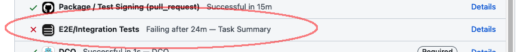
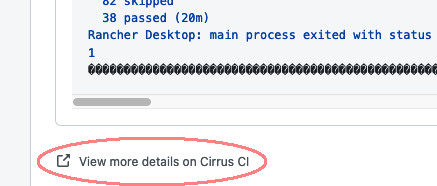
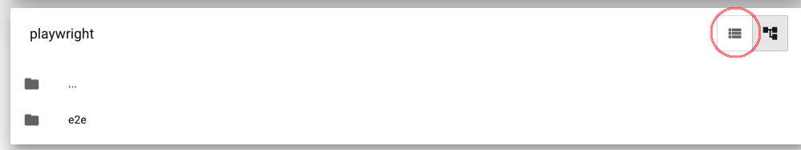
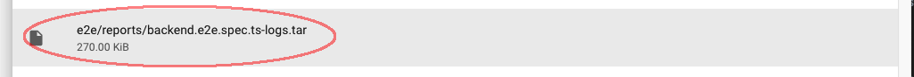

# Contributing to Rancher Desktop

Rancher Desktop accepts contributions via GitHub pull requests.
This document outlines the process to get your pull request accepted.

## Start With An Issue

Prior to creating a pull request it is a good idea to [create an issue].
This is especially true if the change request is something large.
The bug, feature request, or other type of issue can be discussed prior to
creating the pull request. This can reduce rework.

[create an issue]: https://github.com/rancher-sandbox/rancher-desktop/issues/new

## Sign Your Commits

A sign-off is a line at the end of the explanation for a commit.
All commits must be signed. Your signature certifies that you wrote the patch
or otherwise have the right to contribute the material. When you sign off you
agree to the following rules
(from [developercertificate.org](https://developercertificate.org/)):

```
Developer Certificate of Origin
Version 1.1

Copyright (C) 2004, 2006 The Linux Foundation and its contributors.
1 Letterman Drive
Suite D4700
San Francisco, CA, 94129

Everyone is permitted to copy and distribute verbatim copies of this
license document, but changing it is not allowed.

Developer's Certificate of Origin 1.1

By making a contribution to this project, I certify that:

(a) The contribution was created in whole or in part by me and I
    have the right to submit it under the open source license
    indicated in the file; or

(b) The contribution is based upon previous work that, to the best
    of my knowledge, is covered under an appropriate open source
    license and I have the right under that license to submit that
    work with modifications, whether created in whole or in part
    by me, under the same open source license (unless I am
    permitted to submit under a different license), as indicated
    in the file; or

(c) The contribution was provided directly to me by some other
    person who certified (a), (b) or (c) and I have not modified
    it.

(d) I understand and agree that this project and the contribution
    are public and that a record of the contribution (including all
    personal information I submit with it, including my sign-off) is
    maintained indefinitely and may be redistributed consistent with
    this project or the open source license(s) involved.
```

Then you add a line to every git commit message:

    Signed-off-by: Joe Smith <joe.smith@example.com>

Use your real name (sorry, no pseudonyms or anonymous contributions).

If you set your `user.name` and `user.email` git configs, you can sign your
commit automatically with `git commit -s`.

Note: If your git config information is set properly then viewing the `git log`
information for your commit will look something like this:

```
Author: John Smith <john.smith@example.com>
Date:   Thu Feb 2 11:41:15 2018 -0800

    Update README

    Signed-off-by: John Smith <john.smith@example.com>
```

Notice the `Author` and `Signed-off-by` lines match. If they don't your PR will
be rejected by the automated DCO check.

## Pull Requests

Pull requests for a code change should reference the issue they are related to.
This will enable issues to serve as a central point of reference for a change.
For example, if a pull request fixes or completes an issue the commit or
pull request should include:

```md
Closes #123
```

In this case 123 is the corresponding issue number.

### When End-To-End Tests Fail

Every pull request triggers a full run of testing in the CI system.
The failures reported by the code style checker (aka the "linter") and the unit tests are usually
clear and easy to fix (and can be avoided by running `npm test` locally before creating a commit).
But when an integration, or e2e test, fails, it's sometimes useful to consult the log files
for the run.

Here's how to see more details for a failed run:

1. The test results can be found by first going to the GitHub page for the PR.

   1. For a sample, click on an open PR at https://github.com/rancher-sandbox/rancher-desktop/pulls?q=is%3Aopen+is%3Apr

   2. Look for the list of checks

   3. Find the `E2E/Integration Tests` entry

   4. Click on the `Details` link



This takes you to a more detailed view of the test, and which tests failed, but the log files are a few more clicks away.

2. Scroll to the bottom and click on the link that reads `View more details on Cirrus CI`.



3. Once the full test run has completed, the `Artifacts` button acts like a file-system browser.
   The key here is to *not* click on the download button, but to click anywhere else on the row containing the button.


4. This opens up a file browser. Now click on the list-view icon (the left of the two icons at the right of the row).



5. Find the `.tar` file for the failed test, and click on it to download it into your designated `downloads` directory.



6. Because each test's tar file contains the same log files, it's a good idea to extract them into a separate
directory. For example, if you're working with PR 2672:

```bash
Downloads$ mkdir pr2672
Downloads$ cd pr2672
Downloads/pr2672$ unzip ../playwright.zip
Downloads/pr2672$ cd e2e/reports
Downloads/pr2672/e2e/reports$ mkdir backend
Downloads/pr2672/e2e/reports$ cd backend
Downloads/pr2672/e2e/reports/backend$ tar xf ../backend.e2e.spec.ts-logs.tar
Downloads/pr2672/e2e/reports/backend$ ls
background.log     k8s.log              lima.serial.log    settings.log
images.log         lima.ha.stderr.log   mock.log           steve.log
integrations.log   lima.ha.stdout.log   networking.log     update.log
k3s.log            lima.log             server.log         wsl.log
```

At this point, ideally,
the failure in the integration run will be tied to an exception in a log file related to the change in the PR.

Also note that due to code transpilation,
the file names and line numbers in the log files will not usually correspond to the lines in the source code.
You might want to add some `console.log` statements around some changed code that isn't working as expected.

## Semantic Versioning

Rancher Desktop follows [semantic versioning](https://semver.org/).

This does not cover Kubernetes or other tools provided by Rancher Desktop.
Kubernetes has its own [release versioning](https://github.com/kubernetes/community/blob/master/contributors/design-proposals/release/versioning.md#kubernetes-release-versioning)
scheme that looks like SemVer but is semantically different.
