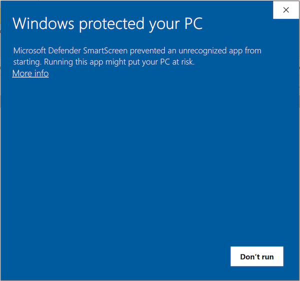
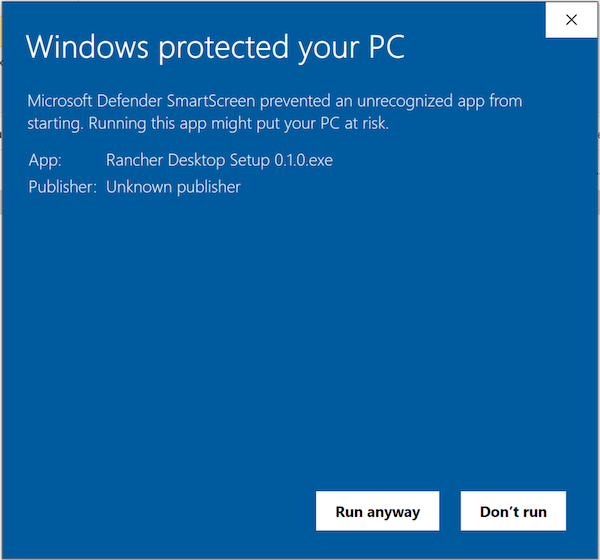

# Installing Rancher Desktop

Rancher Desktop is delivered as a desktop application. You can download it from
the [releases page on GitHub](https://github.com/rancher-sandbox/rd/releases).

When run for the first time or when changing versions, Kubernetes container
images are downloaded. It may take a little time to load on first run for a new
Kubernetes version.

Running on Windows requires [Windows Subsystem for Linux(WSL)].  This will be
installed automatically during the Rancher Desktop setup process.

[Windows Subsystem for Linux(WSL)]:
https://docs.microsoft.com/en-us/windows/wsl/install-win10

Note, the Windows installer is not yet signed. This will happen soon. In the
meantime, when presented with a dialog box like the following, click on "More
info".

The following dialog will then give you the option to run the application:

