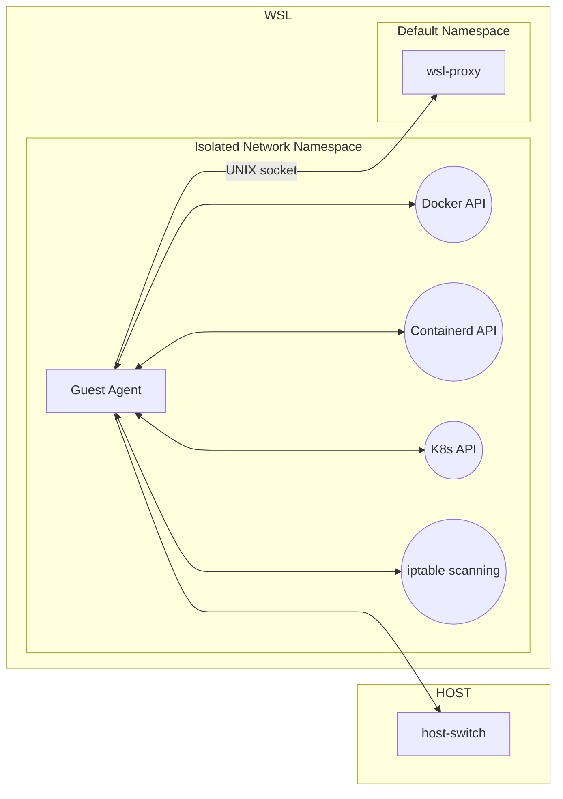
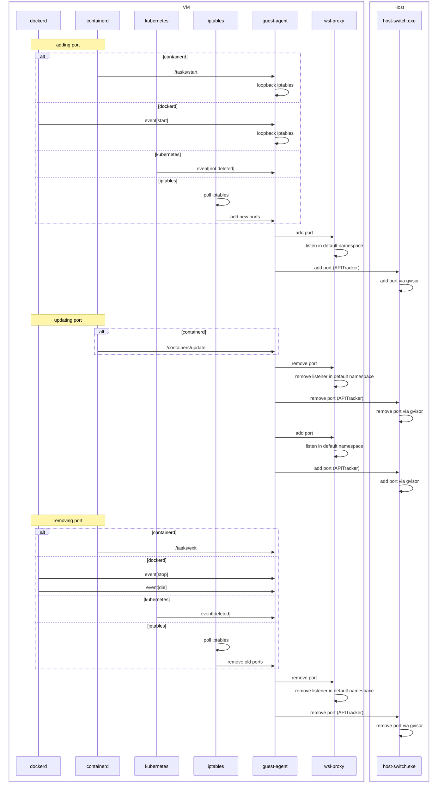
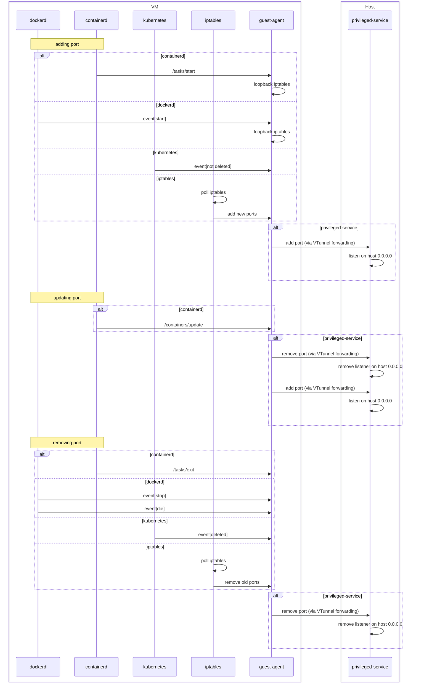

# **[Rancher Desktop Guest Agent](../../../src/go/guestagent)**

The Rancher Desktop Guest Agent operates within the Rancher Desktop WSL distribution, particularly in an isolated namespace when the network tunnel is enabled. It facilitates interactions between various container engine APIs like Moby, containerd, and Kubernetes. The agent monitors container/service creation events from these APIs and, upon detecting ports needing exposure, forwards the port mappings to internal services accordingly. This ensures efficient and automated port forwarding management within the Rancher Desktop environment.



### Supported Flags

-   **debug**: Enables debug logging.

-   **docker**: When this flag is enabled, port mapping via docker API monitoring is enabled. See the port mapping and Docker sections below for details.

-   **kubernetes**: Enables Kubernetes service port forwarding. When enabled, the Rancher Desktop Guest Agent creates a watcher for the Kubernetes API, monitoring NodePort and LoadBalancer services needing port forwarding. For services with exposed ports, the agent creates corresponding port mappings, forwarding them to Rancher Desktop Networking’s `host-switch`, which hosts an API for exposing ports from the host into the network namespace. If WSL integration is enabled, the port mapping is also forwarded to Rancher Desktop Networking’s `wsl-proxy`, allowing access from other WSL distributions.

-   **kubeconfig**: Specifies the path to `kubeconfig` for locating the Kubernetes API endpoint. By default, it looks in `/etc/rancher/k3s/k3s.yaml`.

-   **iptables**: This flag enables the scanning of iptables. In newer versions of Kubernetes, kubelet no longer creates listeners for NodePort and LoadBalancer services. To rectify this, we manually create those listeners so the port forwarding functions correctly. The guest agent creates a corresponding port mapping that represents the service’s exposed port. The port mapping is then forwarded to Rancher Desktop Networking’s `host-switch`, which hosts an API for exposing ports from the host into the network namespace. If WSL integration options are enabled within Rancher Desktop, a copy of that port mapping is also forwarded to Rancher Desktop Networking’s `wsl-proxy`. The `wsl-proxy` exposes the service port to enable users to access it from other WSL distros.

-   **containerd**: When this flag is enabled, the guest agent monitors container events from the containerd API. It connects to the Containerd API via the containerd socket (`/run/k3s/containerd/containerd.sock`). Whenever a container is created or deleted, if there are exposed ports associated with that container, the guest agent creates a corresponding port mapping. This port mapping is then forwarded to Rancher Desktop Networking's `host-switch`, which hosts an API for exposing ports from the host into the network namespace. If WSL integration options are enabled within Rancher Desktop, a copy of this port mapping is also forwarded to Rancher Desktop Networking's `wsl-proxy`. The `wsl-proxy` exposes the container's port to enable users to access it from other WSL distros.

-   **containerdSock**: File path for the containerd socket address. If no argument is provided, it defaults to `/run/k3s/containerd/containerd.sock`.

-   **vtunnelAddr**: Peer address for the Vtunnel process that forwards port mappings to the Vtunnel Host process over `AF_VSOCK`. This feature will soon be deprecated.

-   **privilegedService**: This flag enables privileged service mode. When enabled, the Rancher Desktop guest agent communicates over `AF_VSOCK` to a privileged service process running on the host. This functionality is primarily designed for Windows and will soon be deprecated.

-   **k8sServiceListenerAddr**: Specifies an IP address (`0.0.0.0` or `127.0.0.1`) to bind Kubernetes services on the host.

-   **adminInstall**: This flag indicates whether Rancher Desktop is installed with administrator privileges. It is used to enable Network Tunnel mode, where port mappings are forwarded to Rancher Desktop Networking's `host-switch`. The `host-switch` hosts an API that exposes ports from the host into the network namespace.

-   **k8sAPIPort**: Specifies the Kubernetes API port, which is forwarded to `wsl-proxy` to allow other distros that are part of WSL integrations to  interact via `kubectl`.

## PortMapping

Is a struct object that represents an exposed container or a service. [Portmapping](https://github.com/rancher-sandbox/rancher-desktop-agent/blob/8348a5e10578f8662532eddfac73b243cfd419f4/pkg/types/portmapping.go#L22) objects consist of the following fields:

```
type PortMapping struct {
	// Remove indicates whether to remove or add the entry
	Remove bool `json:"remove"`
	// Ports are the port mappings for both IPV4 and IPV6
	Ports nat.PortMap `json:"ports"`
	// ConnectAddrs are the backend addresses to connect to
	ConnectAddrs []ConnectAddrs `json:"connectAddrs"`
}
```
## Networking Mode

Rancher Desktop Guest Agent can operate in one of three networking modes, depending on startup arguments:

**-privilegedService**

Rancher Desktop utilizes the vtunnel peer process to forward all port mappings to privileged services running on the host, thereby creating port proxies. However, this mode lacks network namespace isolation and shares iptables with other WSL distros, and it will soon be deprecated.

**-adminInstall**

The Network Tunnel mode allows the Guest Agent to operate in an isolated network namespace with a dedicated iptables. This mode is enabled through Rancher Desktop Networking.

Neither  **-privilegedService**  nor  **-adminInstall**

Rancher Desktop Guest Agent operates in non-admin user mode. In this mode, all port mappings are bound to localhost, and the use of privileged ports is restricted.


## Containerd

When containerd mode is enabled, the guest agent monitors the containerd API for the following container events:
```
/tasks/start
/containers/update
/tasks/exit
```
If it detects any exposed ports associated with a container, it creates a port mapping object. Depending on the selected network mode, the port mapping object is then forwarded to the host. If the privileged service is enabled, it utilizes the vtunnel peer process to communicate the port mappings with privileged services. Alternatively, if network tunnel mode is enabled, it sends the port mappings to the API offered in the host switch process.

If network tunnel mode is enabled along with the WSL integration option, a copy of the port mapping is also forwarded to the WSL proxy process, enabling access to the exposed port from other distributions.

## Docker

Similar to containerd mode, when Docker mode is enabled, the guest agent watches Docker API with the following container events filter:
```
Filters: filters.NewArgs(
    filters.Arg("type", "container"),
    filters.Arg("event", startEvent),
    filters.Arg("event", stopEvent),
    filters.Arg("event", dieEvent)
),
```
If it detects any exposed ports associated with a container, it creates a port mapping object. Depending on the selected network mode, the port mapping object is then forwarded to the host. If the privileged service is enabled, it uses the vtunnel peer process to communicate the port mappings with privileged services. Otherwise, if network tunnel mode is enabled, it sends the port mappings to the API offered in the host switch process.

If network tunnel mode is enabled along with the WSL integration option, a copy of the port mapping is also forwarded to the `wsl-proxy` process, allowing access to the exposed port from other distributions.

Additionally, Docker mode creates a series of iptables rules associated with the `PREROUTING` and `POSTROUTING` chains.

The `PREROUTING` rule rewrites the destination IP address of any packets received by the local system and destined for `192.168.127.2` to `127.0.0.1`. Meanwhile, the `POSTROUTING` chain rule rewrites the source IP address of any packets being sent out through the eth0 network interface to the IP address of that interface (eth0). These rules are necessary because when the port binding is set to `127.0.0.1`, an additional `DNAT` rule is added in the main `DOCKER` chain after the existing rule using `--append`.

This adjustment is essential because the initial `DOCKER DNAT` rule created by Docker only allows traffic to be routed to `localhost` from `localhost`. Therefore, an additional rule is added to permit traffic to any destination IP address, enabling the service to be discoverable through the namespaced network's subnet.

These changes are necessary as the traffic is routed via the vm-switch over the tap network. The existing `DNAT` rule is as follows:

```
DNAT tcp -- anywhere localhost tcp dpt:9119 to:10.4.0.22:80
```
The following rule is added after the existing rule:
```
DNAT tcp -- anywhere anywhere tcp dpt:9119 to:10.4.0.22:80
```
## Kubernetes

When this option is enabled, the Rancher Desktop guest agent uses the Kubernetes service watcher to subscribe to the Kubernetes API for any services of type NodePort and LoadBalancer that require port exposure. If the service watcher detects such services, it creates a port mapping object representing each service. The port mapping object is then forwarded to the host based on the selected network mode. If the privileged service is enabled, it uses the vtunnel peer process to communicate the port mappings with privileged services. Otherwise, if network tunnel mode is enabled, it sends the port mappings to the API provided in the host switch process.

It is important to note that if the `k8sServiceListenerAddr` flag is provided, the specified IP address (either `0.0.0.0` or `127.0.0.1`) is used to bind the Kubernetes services on the host.

Additionally, if network tunnel mode is enabled along with the WSL integration option, a copy of the port mapping is also forwarded to the `wsl-proxy` process to allow access to the exposed port from other distributions. However, when the Kubernetes option is enabled, the guest agent statically emits a port mapping to the `wsl-proxy` process in the default network. This port mapping represents the Kubernetes API port (`6443`) to allow access to the Kubernetes API from other distributions.

Below port mapping is an example of what is emitted to `wsl-proxy`:
```
types.PortMapping {
    Remove: false,
    Ports: nat.PortMap {
        port: [] nat.PortBinding {
            {
                HostIP: "127.0.0.1",
                HostPort: 6443,
            },
        },
    },
}
```

## iptables

In [newer versions](https://github.com/rancher-sandbox/rancher-desktop/blob/bb7f71f18828c45b711d6d4982a2dcaf19f8f3fa/pkg/rancher-desktop/backend/k3sHelper.ts#L1152) of Kubernetes, kubelet no longer automatically creates listeners for NodePort and LoadBalancer services. To address this, we manually create these listeners to ensure proper port forwarding functionality. Service ports requiring forwarding are identified in iptables DNAT. When iptables identifies such ports, it creates a port mapping object representing that service. Depending on the selected network mode, the port mapping object is then forwarded to the host. If the privileged service is enabled, it uses the vtunnel peer process to communicate the port mappings with privileged services. Otherwise, if network tunnel mode is enabled, it sends the port mappings to the API provided by the host switch process.

If network tunnel mode is enabled along with the WSL integration option, a copy of the port mapping is also forwarded to the `wsl-proxy` process, allowing access to the exposed port from other distributions.

## Port forwarding (Network Tunnel)



## Port forwarding (Privileged Service)


