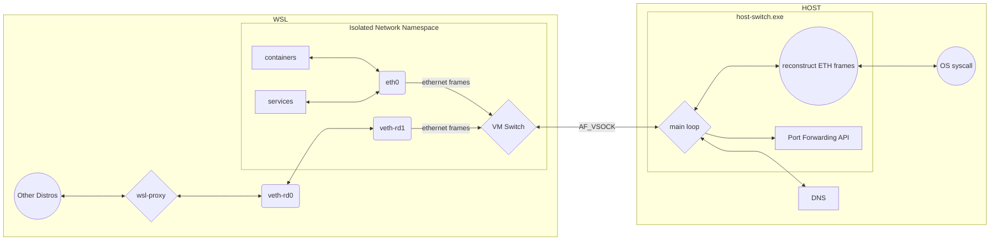
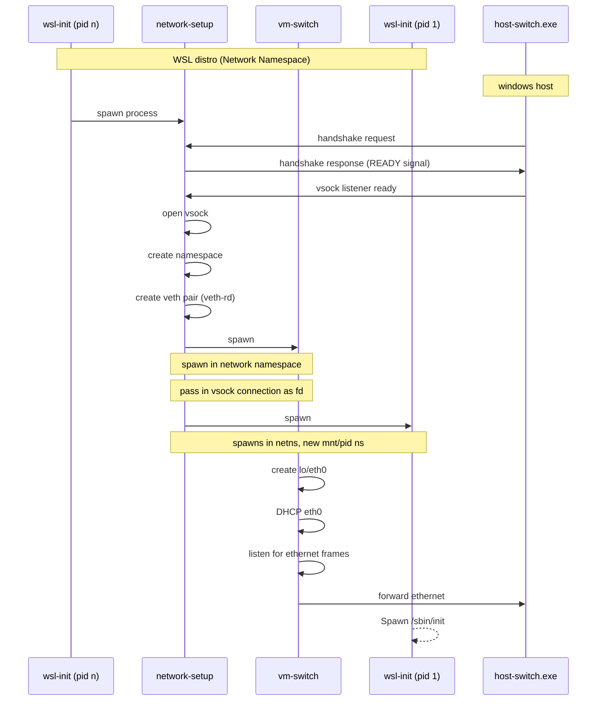

# [Rancher Desktop Networking](https://github.com/rancher-sandbox/rancher-desktop-networking)

Rancher Desktop Networking primarily acts as a layer 2 switch between the host (currently Windows only) and the VM (WSL) using the `AF_VSOCK` protocol. It facilitates the transmission of Ethernet frames from the VM to the host. Additionally, it provides `DNS`, `DHCP`, and dynamic port forwarding functionalities. The Rancher Desktop Networking comprises several key services: `host-switch`, `vm-switch`, `network-setup`, and `wsl-proxy`. It utilizes [gvisor's](https://github.com/google/gvisor) network stack and draws inspiration from the [gvisor-tap-vsock](https://github.com/google/gvisor) project.

The diagram below demonstrates the overall architecture of Rancher Desktop Networking:

## host-switch:

The host-switch runs on the Windows host and acts as a receiver for all traffic originating from the network namespace within the WSL VM. It performs a handshake to identify the correct VM to communicate with over `AF_VSOCK`. This process retrieves the GUID for the appropriate Hyper-V VM (most likely WSL). It then performs a handshake with the network-setup process running in the WSL distribution to ensure the `AF_VSOCK` connection is established with the correct VM. Once the ready signal is received from the vm-switch, an `AF_VSOCK` connection is established to listen for incoming traffic from that VM. Additionally, the host-switch provides a DNS resolver that runs in the user space network and an API for dynamic port forwarding. The port forwarding API offers the following endpoints:

- `/services/forwarder/all`: Lists all the currently forwarded ports.
- `/services/forwarder/expose`: Exposes a port.
- `/services/forwarder/unexpose`: Unexposes a port.

## Supported Flags:

- **debug**: Enables debug logging.
- **subnet**: This flag defines a subnet range with a CIDR suffix for a virtual network. If it is not defined, it uses `192.168.127.0/24` as the default range. It is important to note that this value needs to match the [subnet](https://github.com/rancher-sandbox/rancher-desktop-networking/blob/6abacdc804d6414f17439a97f22e0c9c87f6249d/cmd/vm/switch_linux.go#L59) flag in the vm-switch.
- **port-forward**: This is a list of static ports that need to be pre-forwarded to the WSL VM. These ports are not dynamically retrieved from any of the APIs that the Rancher Desktop guest agent interacts with.

## network-setup:

The reason for its creation was that the `AF_VSOCK` connection could not be established between the host and a process residing inside the network namespace within the VM, as such capability is not currently supported by `AF_VSOCK`. As a result, the network setup was created. Its main responsibility is to respond to the handshake request from the `host-switch.exe`. Once the handshake process is successful with the `host-switch`, the `network-setup` process creates a new network namespace and attempts to start its subprocess, `vm-switch`, in the newly created network namespace. It also hands over the `AF_VSOCK` connection to the `vm-switch` as a file descriptor in the new namespace.

Additionally, it calls unshare with provided arguments through [---unshare-args](https://github.com/rancher-sandbox/rancher-desktop-networking/blob/6abacdc804d6414f17439a97f22e0c9c87f6249d/cmd/network/setup_linux.go#L272). The process also establishes a Virtual Ethernet pair consisting of two endpoints: `veth-rd0` and `veth-rd1`. `veth-rd0` resides within the default namespace and is configured to listen on the IP address `192.168.1.1`. Conversely, `veth-rd1` is located within a network namespace and is assigned the IP address `192.168.1.2`. The virtual Ethernet pair allows accessibility from the default network into the network namespace, which is particularly useful when WSL integration is enabled.

## Supported Flags:

- **debug**: enable the debug logging

- **tap-interface**: The name of the tap interface that is created by the vm-switch upon startup, e.g., `eth0`, `eth1`. This value is passed to the `vm-switch` process when the `network-setup` attempts to start it. If no value is provided, the default name of `eth0` is used.

- **subnet**: A subnet range with a CIDR suffix that is associated with the tap interface in the network namespace. If it is not defined, it uses `192.168.127.0/24` as the default range. It is important to note that this value needs to match the [subnet](https://github.com/rancher-sandbox/rancher-desktop-networking/blob/6abacdc804d6414f17439a97f22e0c9c87f6249d/cmd/host/switch_windows.go#L54) flag in the `host-switch`.

- **tap-mac-address**: MAC address associated with the tap interface created by the vm-switch in the network namespace. If no address is provided, the default address of `5a:94:ef:e4:0c:ee`is used.

- **vm-switch-path**: The path to the `vm-switch` binary that will run in a new namespace. This value is used with `nsenter` to switch the namespace and start the `vm-switch` in the network namespace.

- **vm-switch-logfile**: The path to the logfile for the vm-switch process.

- **unshare-arg**: The command argument to pass to the unshare program in addition to the following [arguments](https://github.com/rancher-sandbox/rancher-desktop-networking/blob/6abacdc804d6414f17439a97f22e0c9c87f6249d/cmd/network/setup_linux.go#L272).

- **logfile**: Path to the logfile for the `network-setup` process.

## vm-switch:

Once the network-setup starts the `vm-switch` process in the new namespace, the `vm-switch` creates a tap device (`eth0`) and a loopback device (`lo`). When the `eth0` tap device is successfully created, it uses the `DHCP` client to acquire an IP address within the defined range from the `DHCP` server. Once the `eth0` tap device is up and running, the kernel forwards all raw Ethernet frames originating from the network namespace to the tap device. In addition to the traffic from the network namespace, the kernel also forwards all the traffic that arrives at `veth-rd1` from its pair, `veth-rd0`, in the default namespace.

The tap device forwards the Ethernet frames over [vsock](https://wiki.qemu.org/Features/VirtioVsock) to the host. The process on the host (`host-switch.exe`) decapsulates the frames. Since host-switch maintains both internal (`vm-switch` to `host-switch.exe`) and external (`host-switch.exe` to the internet) connections, it connects to the external endpoints via syscalls.

## Supported Flags:

- **debug**: Enable the debug logging

- **tap-interface**: Tap interface name to create, eg. eth0, eth1

- **tap-mac-address** : MAC address that is associated with the tap interface

- **subnet**: The subnet range with CIDR suffix associated with the tap interface. Although this value is passed from network-setup, it must match the subnet flag in `host-switch` and `network-setup`.

- **logfile**: Path to `vm-switch` process logfile

## wsl-proxy:

Its primary function comes into play when WSL integration is activated alongside the network tunnel. Running within the default network namespace, it establishes a Unix socket listener (`/run/wsl-proxy.sock`) for the guest agent process to connect to from inside the network namespace. The guest agent forwards port mappings from various APIs (docker, containerd, and K8s) over the Unix socket to the `wsl-proxy`. Upon receiving the port mappings, the wsl-proxy sets up listeners bound to localhost for those ports. When traffic arrives at these listeners, it forwards the traffic to the bridge interface connecting the default namespace to the namespaced network, facilitating bidirectional traffic flow.

## Supported Flags:

- **debug**: Enable the debug logging

- **logfile**: Path to the logfile for `wsl-proxy` process

- **socketFile**: This is the path to the `.sock` file for the UNIX socket connection established between the Rancher Desktop guest agent and the `wsl-proxy`. If not provided, the default value of `/run/wsl-proxy.sock` is used.

- **upstreamAddress**: This is the IP address associated with the upstream server to use. It corresponds to the address of the veth pair connecting the default namespace to the network namespace, specifically `veth-rd1`. The default value is `192.168.1.2`.

## Process Timelines:

Below is a flow chart that demonstrates the process start up orders.

