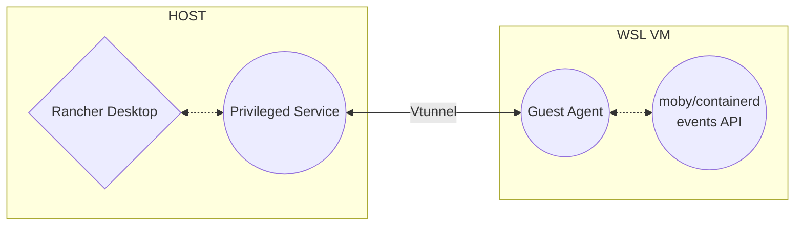

# Rancher Desktop Agent

The Rancher Desktop guest agent runs in Rancher Desktop VMs providing helper
services. It currently has the following functionality:

## Port forwarding with privileged helper:

When the Rancher Desktop Privileged Service is enabled on the host Windows machine via an admin installation of Rancher Desktop, the guest agent watches for port binding events from corresponding backend's API and emits them to the host via a virtual tunnel.

### moby port forwarding (WSL)

Rancher Desktop Guest Agent subscribes to [docker event API](https://docs.docker.com/engine/api/v1.41/#tag/System/operation/SystemEvents) to monitor the newly created published ports. It will then forwards the newly published ports over a `AF_VSOCK` tunnel (Rancher Desktop's `vtunnel`) to [Rancher Desktop Privileged Service](https://github.com/rancher-sandbox/rancher-desktop/tree/main/src/go/privileged-service) that runs on the host machine.

### containerd port forwarding (WSL)

When using the containerd backend, the behaviour of Rancher Desktop Guest Agent is very similar to when the moby backend is enabled. It monitors containerd's event API for the newly created published ports. It will then forwards the newly published ports over a `AF_VSOCK` tunnel (Rancher Desktop's `vtunnel`) to Rancher Desktop Privileged Service that runs on the host machine.

## When Privileged Service is disabled:

When the Rancher Desktop Privileged Service is not enabled on the host Windows machine via a non admin installation of Rancher Desktop, the guest agent watches the iptables for newly added rules.

### containerd port forwarding (WSL) when no privileged service is enabled

When Rancher Desktop Privileged Service is not enabled (non-admin installation), Rancher Desktop Agent falls back to the following behaviour.
In Windows Subsystem for Linux, WSL automatically forwards ports opened on `127.0.0.1` or `0.0.0.0` by opening the corresponding port on `127.0.0.1` on the host (running Windows).  However, `containerd` (as configured by `nerdctl`) just sets up `iptables` rules rather than actually listening, meaning this isn't caught by the normal mechanisms.  Rancher Desktop Agent therefore creates the listeners so that they get picked up and forwarded automatically.  Note that the listeners will never receive any traffic, as the `iptables` rules are in place to forward the traffic before it reaches the application.  This is not necessary
for Lima, as that already does the `iptables` scanning (the core of the code has been lifted from Lima).

## Kubernetes NodePort forwarding

In newer versions of Kubernetes†, `kubelet` no longer creates a listener for NodePort services.  We therefore need to create those listeners manually, so that port forward works correctly as in the container port forwarding above.

† 1.21.12+, 1.22.10+, 1.23.7+, 1.24+
