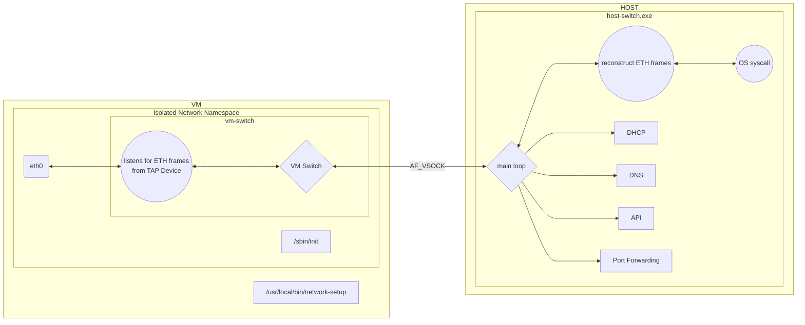
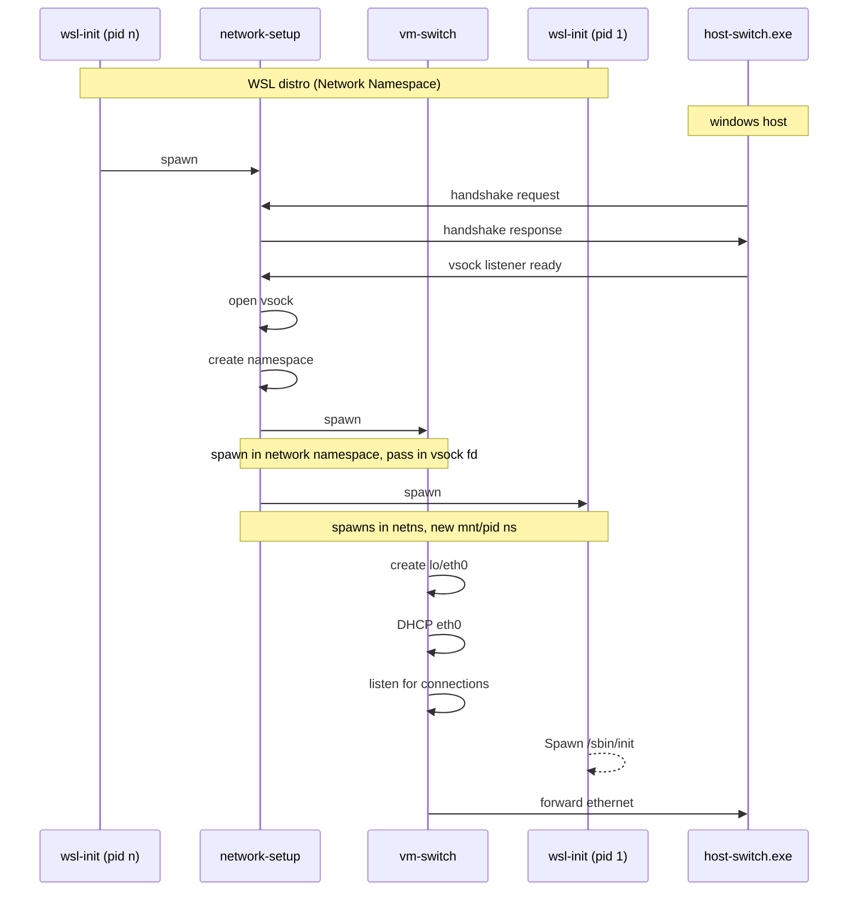

# rancher-desktop-networking
`rancher-desktop-networking` is a simple layer 2 switch that allows connectivity between the VM and the host over `AF_VSOCK` written in Go using [gvisor's](https://github.com/google/gvisor) network stack and [gvisor-tap-vsock](https://github.com/google/gvisor). In addition to piping the ethernet frames, it also provides DNS, DHCP services and dynamic port forwarding.

Rancher Desktop Networking consists of three main components: host-switch, vm-switch, and network-setup. Below is a brief explanation of what each component does.

## How it works

## host-switch
`host-switch` runs on the Windows host and acts as a receiver for all traffic originating from the network namespace within the WSL VM. It performs a handshake to find the right VM to talk to over `AF_VSOCK`. Once a correct VM is found, it then listens for the incoming traffic from that VM. In addition to this, it can provide a DNS resolver that runs in the user space network along with an API that allows for dynamic port forwarding.

## network-setup
Its main responsibility is to respond to the handshake request from the `host-switch.exe`, create a network namespace and start the `vm-switch` subprocess in the newly created network namespace. In addition, it also calls unshare with provided arguments through `--unshare-args`. Below is a sequence diagram demonstrating the process. The process also establishes a Virtual Ethernet pair consisting of two endpoints: `veth-rd0` and `veth-rd1`. `veth-rd0` resides within the default namespace and is configured to listen on the IP address `192.168.1.1`. Conversely, `veth-rd1` is located within a network namespace and is assigned the IP address `192.168.1.2`.

## vm-switch
Once the `vm-switch` process starts in the new namespace, it creates a tap (`eth0`) and a `lo` device. The Kernel then forwards all the raw Ethernet frames to the tap device. The tap device forwards the frames over [vsock](https://wiki.qemu.org/Features/VirtioVsock) to the host. The process on the host (`host-switch.exe`) decapsulates the frames, and since it maintains both internal (`vm-switch` to `host-switch.exe`) and external (`host-switch.exe` to the internet) connections, it connects to the external endpoints via normal syscalls.

## wsl-proxy

Its primary function comes into play when WSL integration is activated alongside the network tunnel. It runs in the default network namespace and establishes a Unix socket listener for the guest agent process to connect to from inside the network namespace. The guest agent forwards the published ports from various APIs (docker, containerd, and K8s) over the Unix socket to the WSL-proxy. Once the WSL-proxy receives this information, it establishes a listener on the localhost bound to that port. When traffic is received on that listener, it then pipes the traffic to the bridge interface that connects the default namespace to the namespaced network, which forwards the traffic to the namespace and back.
