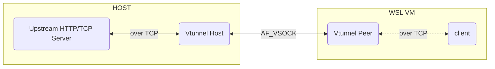

# vtunnel

Vtunnel is a virtual tunnel that leverages AF_VSOCK virtual socket. Vtunnel runs two processes one is the host process that runs on the host machine, the second one is the peer process that runs insided a hyper-v VM (e.g. WSL).

## Host

The host process can be configured with an upstream HTTP/TCP server to forward the requests to. The tunnel accepts the incoming vsock requests over AF_VSOCK and for every request it creates a connection to the given upstream server to pipe the data forward.

## Peer

The Peer process starts a TCP server inside the hyper-v VM and listens for all the incoming requests, once a request is recieved it forwards it over the AF_SOCK to the host.



## Manual Testing

 - You will need to build the binaries for both Host and Peer processes:
```bash
 GOOS=windows go build
 GOOS=linux go build
```
 - Move the vtunnel to the hyper-v VM and Run the Peer process:
 ```bash
 ./vtunnel peer -p 9090 -v 8989 -t 3030
 ```
 - Use netcat or a similar approach to run a HTTP/TCP server on the host machine:
 ```bash
 python3 -m http.server 3030
 ```
 - Run the host process on windows:
 ```pwsh
 .\vtunnel.exe host -a 127.0.0.1:4444 -p 9090 -v 8989
 ```
 - Using Curl or similar utilities send a request to the Peer TCP server inside the VM.
 ```bash
 curl localhost:4444
 ```
